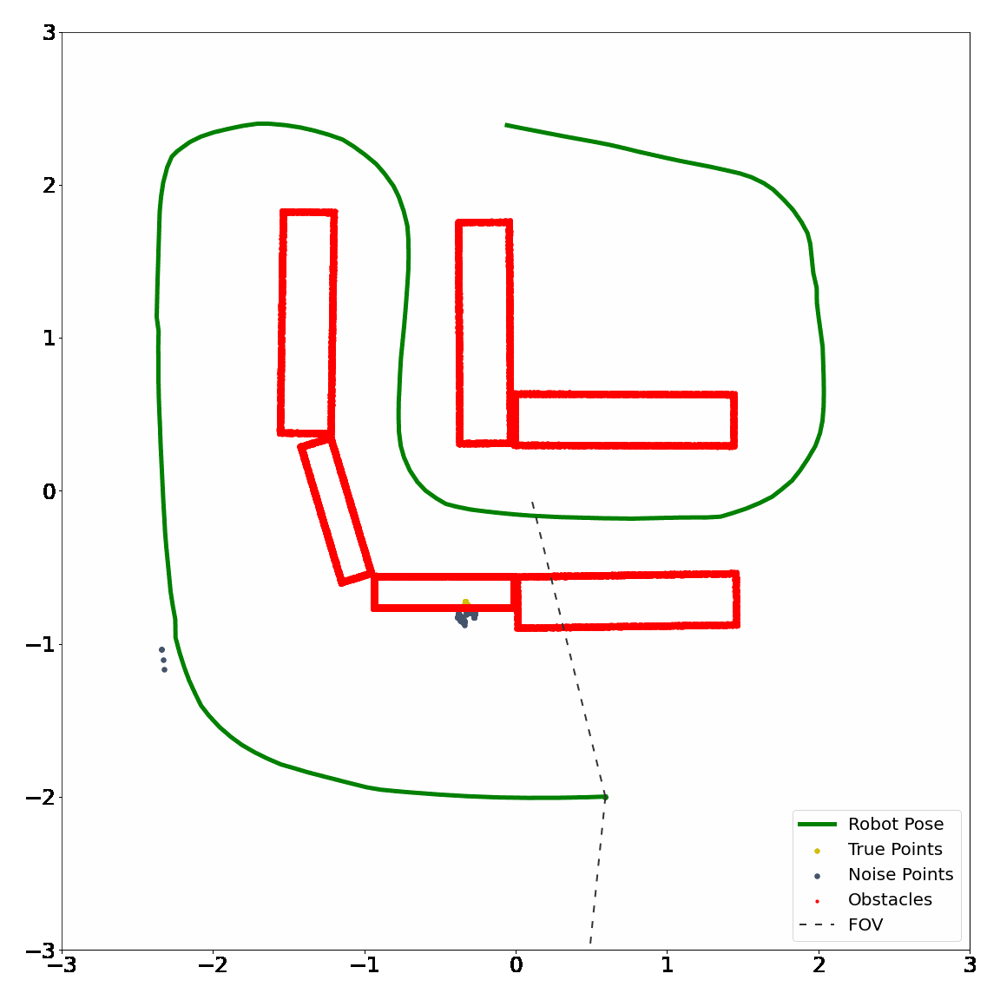
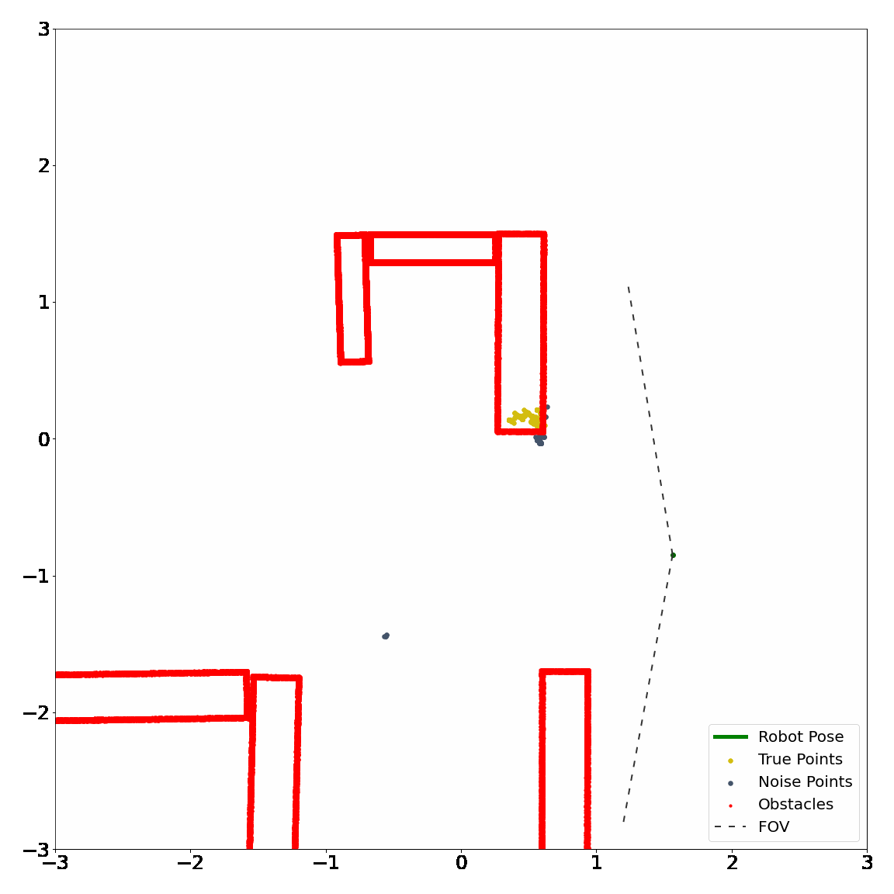
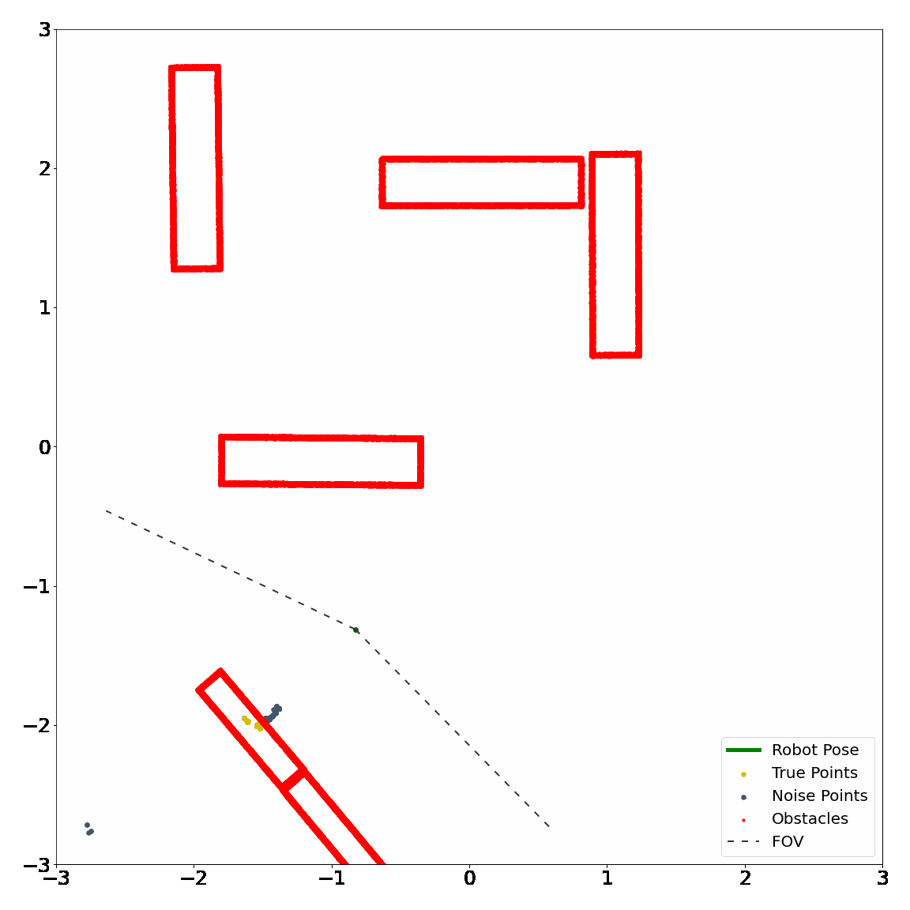

# MilliNoise: a millimeter-wave sparse point cloud dataset in indoor scenarios

Millimeter-wave radar sensors sensors produce PCs that are much sparser and noisier than other PC data (e.g., LiDAR), yet they are more robust in challenging conditions such as in the presence of fog, dust, smoke, or rain. This paper presents MilliNoise, a millimeter-wave sparse point cloud dataset captured in indoor scenarios. Each point in MilliNoise is accurately labelled as true/noise point by leveraging known information of the scenes and a motion capture system to obtain the ground truth position of the moving robot. Each frame is carefully pre-processed to produce a fixed number of points for each cloud, enabling the employment of classification tools which require such characteristic. MilliNoise has been post-processed as well to allow moving the denoising task into the regression framework, by labelling each point with the distance to its closest obstacle in the scene.

## Scenes Collected
<table>
    <tr>
        <td>
            <table>
                <tr><td> <h2> 
 Scene 0 
 </h2> </td></tr>
                <tr><td>  </td></tr>
            </table>
        </td>
        <td>
            <table>
                <tr><td> <h2> 
 Scene 1 
 </h2> </td></tr>
                <tr><td>  </td></tr>
            </table></td>
        <td>
            <table>
                <tr><td> <h2> 
 Scene 5 
 </h2> </td></tr>
                <tr><td>  </td></tr>
            </table>
        </td>
    </tr>
    <tr>
        <td>
            <table>
                <tr><td> <h2> 
 Scene 6 
 </h2> </td></tr>
                <tr><td>  </td></tr>
            </table>
        </td>
        <td>
            <table>
                <tr><td> <h2> 
 Scene 8 
 </h2> </td></tr>
                <tr><td>  </td></tr>
            </table>
        </td>
        <td>
            <table>
                <tr><td> <h2> 
 Scene 9 
 </h2> </td></tr>
                <tr><td>  </td></tr>
            </table>
        </td>
    </tr>
</table>